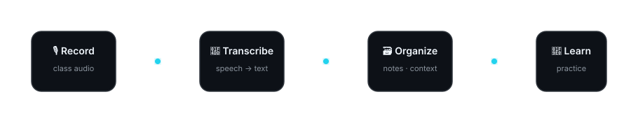

 

## ✦ About me ✦

I'm a student interested in **private AI for learning, AI agents, frontier and local AI, self-hosting, networking, and offensive security / pentesting**.

🤖 Most of what I build revolves around **durable AI agents** that can work with memory, tools, files, APIs, servers, transcripts, notes, and other real context — not just answer isolated prompts.

📚 My main project is **Student Companion** — a private study system built around class recordings, transcripts, notes, lesson context, source-grounded explanations, and progress tracking.

🖥️ I also experiment with **frontier models, local inference, homelab infrastructure, automation, and running useful AI systems on consumer hardware**.

---

## ⚙️ My AI workflow

 

I'm most interested in agent pipelines that can work with **real systems and persistent context**: tool calls, MCP servers, APIs, files, services, data, and state.

---

## 📚 Student Companion

 

The goal is to turn what happens in class into useful, traceable context: **recordings → transcripts → organized notes → grounded explanations → practice → progress**.

The important part is that the system stays honest about **what came from class, what came from stored context, and what the AI generated**.

---

## 🧩 What I'm working on

<table>
<tr>
<td width="50%" valign="top">

### 🤖 AI agents

Tool use, autonomous workflows, MCP servers, APIs and connecting models to real services.

 

</td>
<td width="50%" valign="top">

### 📚 Student Companion

Building a private study system around recordings, transcripts, notes, lesson context, source grounding and progress.

 

</td>
</tr>
<tr>
<td width="50%" valign="top">

### 🏠 Homelab

Self-hosted services, Linux servers, networking and infrastructure I can experiment with.

 

</td>
<td width="50%" valign="top">

### 🧠 Frontier + local AI

Comparing frontier models and local inference: agent capability, latency, cost, hardware limits and practical deployment.

 

</td>
</tr>
</table>

---

## 🛠️ Tools & technologies

  

 

---

## 🎯 Current focus

🔌 **Agents + MCP** — connecting models to tools, files, servers and services  
📖 **Student Companion** — making transcripts, notes, source context and AI explanations actually useful  
🧠 **Frontier + local AI** — comparing leading hosted models with local inference on consumer hardware  
🐧 **Homelab** — improving reliability, networking and self-hosted services  
🔐 **Offensive security / pentesting** — testing systems, finding weaknesses and learning how exploitation works  
💻 **Software development** — getting better by building things I actually use

 

---

I'm still learning, and most of what you'll find here comes from **building things I actually want to use**, experimenting with them, and improving them as I understand more.

